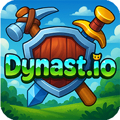

<div id="top"></div>

<!-- PROJECT LOGO -->
<br />
<div align="center">
  <a href="#">
    
  </a>
  <h3 align="center">Dynastio.Net</h3>
  <p align="center">
   Dynastio.Net is an unofficial .NET API Wrapper for the Dynast.io client.
    <br />  <br />
    <a href="https://github.com/JalalJaleh/Dynastio.Net/releases">Releases</a>
    ·
    <a href="https://github.com/JalalJaleh/Dynastio.Net/issues">Report Bug</a>
    ·
    <a href="https://github.com/JalalJaleh/Dynastio.Net/issues">Request Feature</a>
  </p>
</div>

<div align="center">
  <a href="https://www.nuget.org/packages/Dynastio.Net/">
    
  </a>
  <a href="https://discord.gg/GVUXMNv7vV">
    
  </a>
</div>

<br>
<br>

# Dynastio.Net

Dynastio.Net is an unofficial, modern, high‑performance .NET API client for interacting with Dynast.io game services, enabling access to player stats, servers, leaderboards, and more for bots, dashboards, and companion apps.


## Why this library

Built to make Dynast.io data easy to consume, Dynastio.Net powers practical use cases like Discord bots, overlays, and gameplay analytics. It’s the API library behind the Dynastio.Bot project and was created with that integration in mind.

- **Discord bots:** Streamline commands that surface player stats and server info.  
- **Dashboards/overlays:** Display live server and leaderboard data.  
- **Automation:** Track trends, alerts, and match histories.  
- **Companion tools:** Enrich community apps with authenticated player data.

> Unofficial wrapper structured around public behavior of the Dynast.io API.

---

## Installation

Install via NuGet using your preferred workflow:

- **Package Manager:**
  ```
  Install-Package Dynastio.Net
  ```
- **.NET CLI:**
  ```
  dotnet add package Dynastio.Net
  ```
These commands are published with the package on NuGet and the repository readme.

Supported target frameworks include .NET 5.0 and .NET Framework 4.6 and higher, per the NuGet listing.

---

## Quick start

Below is a minimal example to list online servers and inspect top server stats. The structure mirrors the samples and published usage shown in the package documentation and historical listings.

```csharp
using System;
using System.Linq;
using System.Threading.Tasks;

using Dynastio.Net; // Namespace may vary depending on the package assembly

class Program
{
    static async Task Main()
    {
        // Replace with your Dynast.io API token
        var client = new DynastioClient("YOUR_API_TOKEN");

        // Get online servers (async)
        var onlineServers = await client.Game.GetOnlineServersAsync();
        Console.WriteLine($"Servers: {onlineServers.Count} online.");

        // Peek at one server's highlights
        var server = onlineServers.FirstOrDefault();
        if (server != null)
        {
            Console.WriteLine($"Server: {server.Label}");
            Console.WriteLine($"Top player: {server.TopPlayerName} ({server.TopPlayerScore})");
            Console.WriteLine($"Lifetime: {server.Lifetime}");
        }

        // Example: fetch a player's personal chest by external ID (e.g., Discord)
        var chest = await client.Database.GetUserPersonalChestAsync("discord:YOUR_DISCORD_ID");
        foreach (var item in chest.Items)
            Console.WriteLine($"{item.ItemType}: {item.Count}");
    }
}
```

> See repository samples for additional patterns and context on async usage.

---

## Features

Dynastio.Net focuses on an ergonomic, async-first developer experience with practical endpoints for community tools. Highlights include:

- **Live data:** Fetch online servers and current player info.
- **Leaderboards:** Pull rank snapshots and surrounding ranks.
- **Player profiles:** Retrieve profiles and personal chests.
- **Announcements/media:** Read featured videos and news.
- **Performance:** Built-in caching to reduce API load.
- **Async by default:** Optimized with System.Text.Json.
- **Extensible:** Clear structure for customization and extension.

---

## API overview

The client surface generally maps to domain areas like Game and Database, exposing common operations shown in public examples and package docs.

- **Game:**
  - **Online servers:** Enumerate servers and inspect properties like top player and lifetime.
  - **Version/changelog:** Query current version metadata.
- **Players:**
  - **Live players per server:** Inspect active player list with nickname and score.
  - **Profiles and stats:** Retrieve profile details and ranks.
- **Database:**
  - **Personal chest:** Fetch authenticated inventory-style data linked to user IDs.

> Endpoint coverage and names evolve with the Dynast.io service; check samples and source for current shapes.

---

## Used by Dynastio.Bot

Dynastio.Net is used in the open-source Dynastio.Bot, a .NET Core Discord bot that integrates deeply with Dynast.io. The library was effectively made to support that bot’s needs, and serves as its API backbone.

---

## Roadmap

Planned enhancements include real-time updates (e.g., websockets where applicable), stronger error handling, localization improvements, and richer SDK documentation and IntelliSense, as outlined in the repository.

---

## Contributing

Contributions are welcome:
1. **Fork:** Create your copy of the repository.
2. **Branch:** git checkout -b feature/YourFeature
3. **Commit:** Write clear, atomic commits.
4. **PR:** Open a pull request describing changes and context.

Open issues for ideas, bugs, or questions.

---


## Acknowledgments and disclaimer

- **Dynast.io:** This library targets the Dynast.io ecosystem and its community tools.  
- **Unofficial:** The project is an unofficial wrapper built against public, observable behavior of the Dynast.io API.

> If you build something with it, share it—I’d love to see what you create with your data story. It’s more than endpoints; it’s how you bring the game to life.

> Sources: 
<br>

<!-- LICENSE -->
## 🪪 License

Dynastio.Net is available under the **MIT License**. See [`LICENSE.txt`](LICENSE.txt) for full license text.

<br>

<!-- CONTACT -->
## 📬 Contact

- Author: [Jalal Jaleh](https://github.com/jalaljaleh)
- Discord: [Halun Team](https://discord.gg/x5j4cZtnWR)

Project Link: [https://github.com/jalaljaleh/Dynastio.Net](https://github.com/jalaljaleh/Dynastio.Net)

<p align="right">(<a href="#top">back to top</a>)</p>

